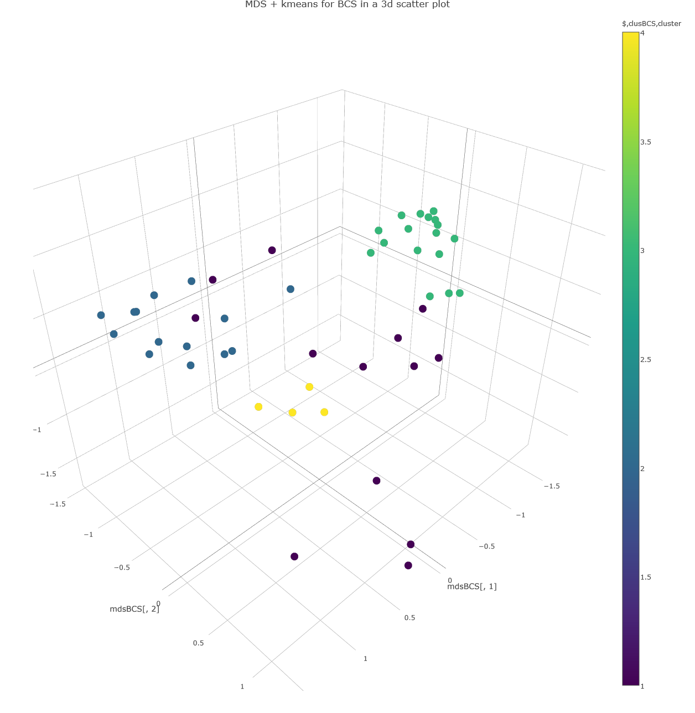
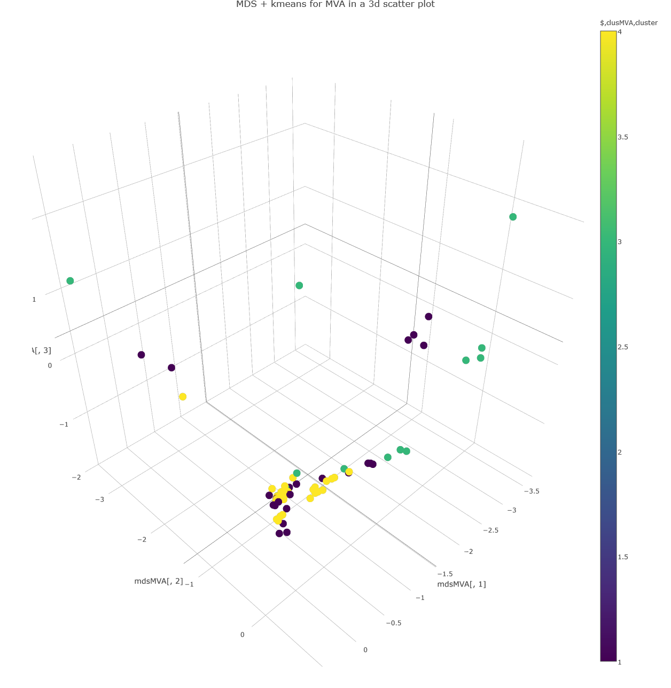

[](http://quantlet.de/index.php?p=info)

## [](http://quantlet.de/) **MVAQnetClusKmeans_plotly** [](http://quantlet.de/d3/ia)

##  [Interactive Plotly:BCS](http://d3akula.github.io/Plotly/qnet_bcs_plotly.html)

##  [Interactive Plotly:MVA](http://d3akula.github.io/Plotly/qnet_mva_plotly.html)

```yaml

Name of QuantLet : MVAQnetClusKmeans_plotly

Published in : Applied Multivariate Statistical Analysis

Description : 'The document similarity of quantlets is calculated based on their keywords. For this
purpose quantlets are taken from the MVA book and BCS project. First the keywords are transformed
into the vector representation. Then the scalar product is applied calculating so the similarity
measure. The advanced term-term correlation model additionally uses the term-term correlation
matrix between the terms of all documents. Finally the k-means algorithm with the Euclidean norm is
applied for clustering (four clusters) and the data are represented via MDS (multidimensional
scaling) showing metric MDS for BCS quantlets and metric MDS for MVA quantlets. Plotly technology
is used for visualization(D3.js and Java Script)'

Keywords : 'cluster-analysis, plot, graphical representation, kmeans, distance, euclidean,
euclidean-norm, multi-dimensional, scaling, MDS, similarity, data visualization'

See also : 'MVAQnetClusKmeansB, MVAQnetClusKmeansT, MVAclus8p, MVAclusbank, MVAclusbh, MVAclusfood,
MVAclususcrime, MVAdrugsim, SMSclus8p, SMSclus8pd, SMSclus8pmst2, SMSclushealth, SMScluscrimechi2,
SMSclusbank, SMSclusbank2, SMSclusbank3, SMScluscomp, SMScluscrime'

Author : Lukas Borke

Submitted : March 03 2016 by Lukas Borke

Datafile : export_q_kw_141.dat, export_q_kw_310.dat, export_q_kw_All.dat

Example: 
- 1: Plotly (D3.js and Java Script) plot Metric MDS for BCS quantlets
- 2: Plotly (D3.js and Java Script) plot Metric MDS for MVA quantlets

```






```r

# clear all variables
rm(list = ls(all = TRUE))
graphics.off()

# install and load packages
libraries = c("plotly")
lapply(libraries, function(x) if (!(x %in% installed.packages())) {
    install.packages(x)
})
lapply(libraries, library, quietly = TRUE, character.only = TRUE)

D         = as.matrix(read.table("export_q_kw_All.dat"))

# take everything but ID
E         = D[, -1]
IDall     = D[, 1]                  # Quantlet IDs 

# transpose and norm to one columnwise, then a column equals the vector representation of a Qlet
norm.E    = apply(t(E), 2, function(v) {
    v/sqrt(sum(v * v))
})
norm.E[is.na(norm.E)] = 0

# cache global Qlet matrix as norm, needed for following transformations
D_global  = norm.E

# read vector matrix from BCS and norm it
D         = as.matrix(read.table("export_q_kw_310.dat"))
E         = D[, -1]                 # extract everything but ID
IDB       = D[, 1]                  # set ID

# transpose and norm to one columnwise, then a column equals the vector representation of a Qlet
norm.E    = apply(t(E), 2, function(v) {
    v/sqrt(sum(v * v))
})
norm.E[is.na(norm.E)] = 0

# transpose the BCS vector representation of the basis model into T model
# (term-term-correlation) one column in D_T_310 is equivalent to the vector
# representation of a Qlet in the T model
D_T_310   = t(D_global) %*% norm.E

# read vector matrix from MVA and norm it
D         = as.matrix(read.table("export_q_kw_141.dat"))
E         = D[, -1]                 # extract everything but ID
IDM       = D[, 1]                  # set ID

# transpose and norm to one columnwise, then a column equals the vector representation of a Qlet
norm.E    = apply(t(E), 2, function(v) {
    v/sqrt(sum(v * v))
})
norm.E[is.na(norm.E)] = 0

# transpose the MVA vector representation of the basis model into T model
# (term-term-correlation) one column in D_T_141 is equivalent to the vector
# representation of a Qlet in the T model
D_T_141   = t(D_global) %*% norm.E

# MDS + kmeans for BCS
set.seed(12345)                     # set pseudo random numbers
d         = dist(t(D_T_310))        # Euclidean norm
clusBCS   = kmeans(d, 4)            # kmeans for 4 clusters/centers
mdsBCS    = cmdscale(d, k = 3)      # mds for 2 dimensions

# Plotly Plot 1
p <- plot_ly(x = mdsBCS[,1], y = mdsBCS[,2], z = mdsBCS[,3], type = "scatter3d", mode = "markers", color = clusBCS$cluster) %>% 
  layout(title = "MDS + kmeans for BCS in a 3d scatter plot",
         scene = list(
           xaxis = list(title = "X"), 
           yaxis = list(title = "Y"), 
           zaxis = list(title = "Z")))
p

# MDS + kmeans for MVA
set.seed(12345)                     # set pseudo random numbers
d         = dist(t(D_T_141))
clusMVA   = kmeans(d, 4)
mdsMVA    = cmdscale(d, k = 3)

# Plotly Plot 2

p <- plot_ly(x = mdsMVA[,1], y = mdsMVA[,2], z = mdsMVA[,3], type = "scatter3d", mode = "markers", color = clusMVA$cluster) %>% 
  layout(title = "MDS + kmeans for MVA in a 3d scatter plot",
         scene = list(
           xaxis = list(title = "X"), 
           yaxis = list(title = "Y"), 
           zaxis = list(title = "Z")))
p

```
